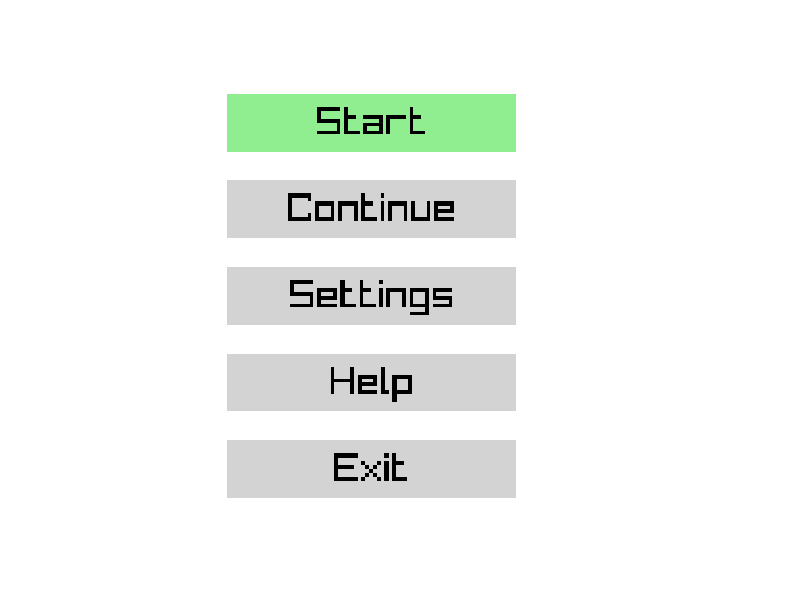
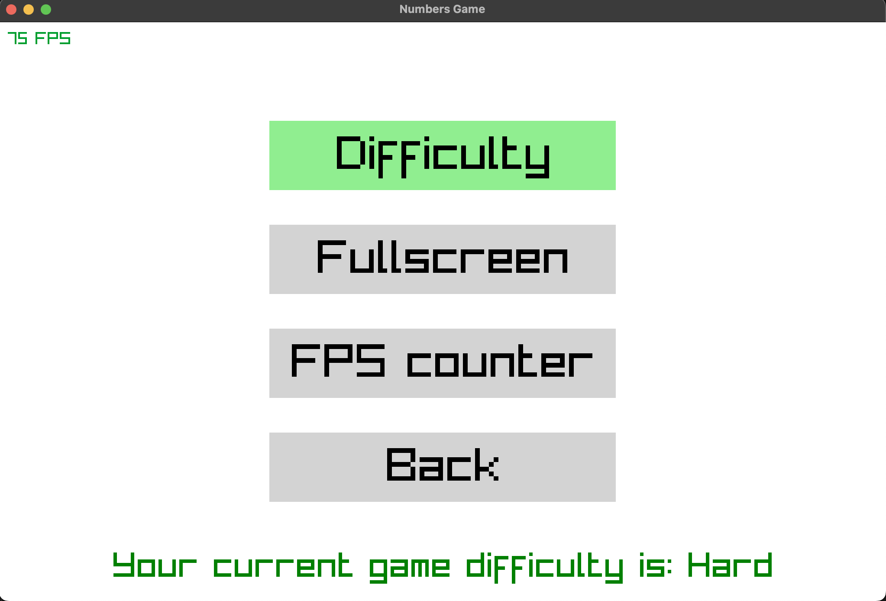
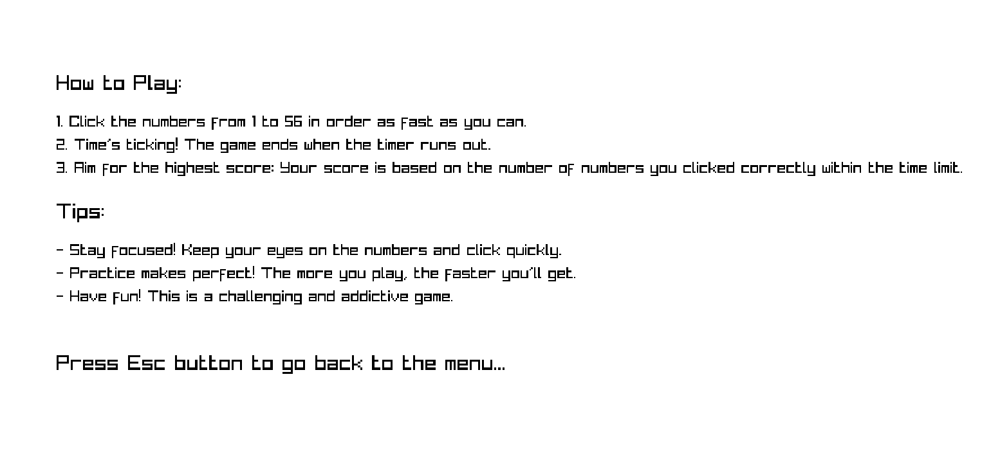
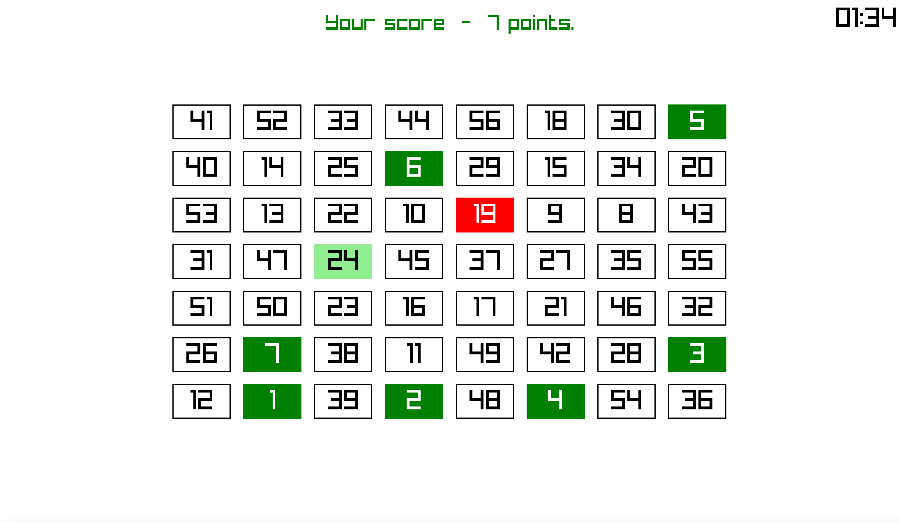

# Numbers game

## How to run

Build dependencies with `cargo build`, and then run with `cargo run`.

## Features

* Game Menu;
* Settings:
    - Game difficulty *(Easy, Hard)*
    - Fullscreen mode
    - FPS counter;
* Help screen;
* Timer to finish game level;
* Score system;
* Continue game *(if you want to make a pause)*;

### Font

Lemon Milk (Light)

## Screenshots

### Menu

### How to Play

### Gameplay

